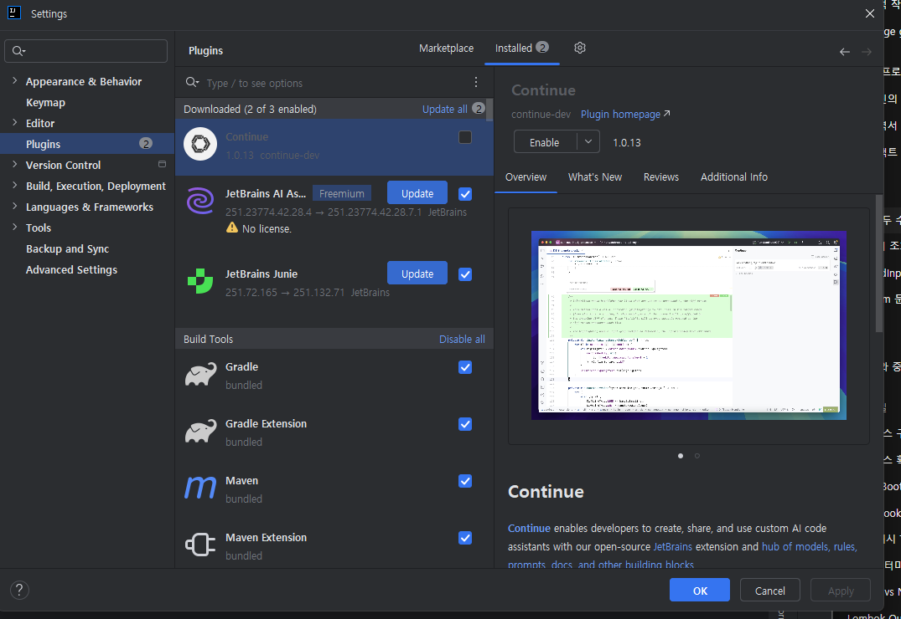

# 1주차

# 문제 풀면서 든 생각들

### IDE 설정하기

- IDE의 자동 완성, 자동 import를 자꾸 사용하게 되는데,
코테 환경에 맞춰서 할 수 있도록 설정 만질 필요가 있을 듯
- Intellij AI 자동완성 및 문법 자동완성 비활성화 방법
    - AI 자동완성 비활성화
        - ctrl+alt+s, settings에서 AI 관련 플러그인 비활성화 (나는 Continue, Jetbrains AI Assistant)
            
            
            
    - IDE 자체 자동완성 비활성화
        - ctrl+alt+s, settings에서 sueggestion 검색, inline completion의 suggestion 모두 해제
            
            
            

### 다른 분들 코드 작성환경

- 다른 분들은 자기 코드 작성 및 검증 어떻게 하는지 궁금…
    - 프로젝트 별도로 생성해서 코드 작성 후에 boj에 제출한 코드를 github에 올리는건지..?
        - 아니면 github 폴더에서 바로 작업하는 방법이 있는지..?
    - 테스트 케이스 검증 자동화 비법..?

### 코딩테스트 기초 문법 정리 ex) 입력, 토큰화

- 입/출력을 다루는거 자체가 익숙하지 않아서, 문제마다 조금씩 다르게 받고 있음.  
    -> 문제 풀어가면서 규격화 할 필요가 있을듯
    
    **문자열 한 줄 받기**
    
    ```java
    /*
    입력: abcde
    결과: "abcde"
    */
    
    import java.io.BufferedReader;
    import java.io.IOException;
    import java.io.InputStreamReader;
    
    public static void main(String[] args) throws IOException {
    	BufferedReader bf = new BufferedReader(new InputStreamReader(System.in));
    	String line = bf.readline();
    }
    ```
    
    **숫자 한 줄 받기**
    
    ```java
    /*
    입력: 12345
    결과: (int 타입) 12345 
    */
    
    import java.io.BufferedReader;
    import java.io.IOException;
    import java.io.InputStreamReader;
    
    public static void main(String[] args) throws IOException {
    	BufferedReader bf = new BufferedReader(new InputStreamReader(System.in));
    	int line = Integer.parseInt(bf.readline());
    }
    ```
    
    **공백으로 구분된 문자열 한 줄 리스트로 받기**
    
    ```java
    /*
    입력: abc cde def
    결과: ["abc", "cde", "def"]
    */
    String[] line = bf.readline().split(" ");
    ```
    
    **공백으로 구분된 숫자 한 줄 리스트로 받기**
    
    ```java
    /*
    입력: 1 2 3 4 5
    결과: [1, 2, 3, 4, 5]
    */
    import java.util.*; ==> 필수
    
    String[] line = bf.readline().split(" ");
    int[] intLine = Arrays.stream(line).mapToInt(Integer::parseInt).toArray();
    ```
    

# 막힌 문제

---

# [두 수의 합](https://www.acmicpc.net/problem/3273)

### 문제

n개의 서로 다른 양의 정수 a1, a2, ..., an으로 이루어진 수열이 있다. ai의 값은 1보다 크거나 같고, 1000000보다 작거나 같은 자연수이다. 자연수 x가 주어졌을 때, ai + aj = x (1 ≤ i < j ≤ n)을 만족하는 (ai, aj)쌍의 수를 구하는 프로그램을 작성하시오.

### 입력

첫째 줄에 수열의 크기 n이 주어진다. 다음 줄에는 수열에 포함되는 수가 주어진다. 셋째 줄에는 x가 주어진다. (1 ≤ n ≤ 100000, 1 ≤ x ≤ 2000000)

### 출력

문제의 조건을 만족하는 쌍의 개수를 출력한다.  

### 예제

**입력**

```
9
5 12 7 10 9 1 2 3 11
13
```

**출력**

```
3
```

- **최초 접근**
    - 2중 for문으로 수열 순회하면서 두 수의 합이 x와 같은지 체크 ⇒ **시간초과**
- **풀이법 (투 포인터 알고리즘)**
    1. 수열 정렬
    2. 가장 작은 수를 가리키는 인덱스와, 가장 큰 수를 가리키는 인덱스 설정
    3. 작은 수 인덱스는 올리고, 큰 수 인덱스를 내려가며 조건에 부합하는지 체크
    4. 작은 수 인덱스가 큰 수를 넘어서면 종료
    - 예시
        - 입력
            - len=7
            - [1, 3, 2, 4, 5, 6, 7]
            - x=8
        
        일단 정렬하면… arr = [1,2,3,4,5,6,7]
        
        left=0, right = 6 (7-1)
        
        아래 표는 `left < right`인 동안 매 반복마다 변수 상태를 정리한 것입니다.
        
        | 반복 번호 | left 인덱스 | right 인덱스 | arr[left] | arr[right] | sum = arr[left] + arr[right] | 비교 결과 | 동작 | equalcount |
        | --- | --- | --- | --- | --- | --- | --- | --- | --- |
        | 초기 상태 | 0 | 6 | 1 | 7 | (1 + 7) = 8 | sum == x | → `equalcount++`, `left++`→1, `right--`→5 | 1 |
        | 1회차 | 1 | 5 | 2 | 6 | (2 + 6) = 8 | sum == x | → `equalcount++`, `left++`→2, `right--`→4 | 2 |
        | 2회차 | 2 | 4 | 3 | 5 | (3 + 5) = 8 | sum == x | → `equalcount++`, `left++`→3, `right--`→3 | 3 |
        | 3회차 시도 | 3 | 3 | 4 | 4 | (4 + 4) = 8 | ※ left == right | 루프 조건(`left < right`)이 거짓 → 반복 종료 |  |
    
- **별해**
    1. 입력받을 수 있는 수 범위에 해당하는 배열 생성
    2. 입력 값 받아서 해당 배열의 인덱스에 1로 표시 (존재 여부 체크)
    3. 두 수의 합(t)를 만들 수 있는 모든 경우의 수를 순회, 두 수가 모두 배열에 존재하면 count++
    4. 결과 출력 시에는 두 수가 두 번 표시되었으므로 count 반띵…. (심지어 c에서는 bit right shift 하면됨)
    - 예시
        - 입력: {2, 3, 7, 5},  t=10
            1. 비트셋 세팅
                
                ```
                B[2] = 1, B[3] = 1, B[5] = 1, B[7] = 1
                ```
                
            2. 루프 실행 (i=1i=1i=1부터 999까지)
                
                
                | i | t-i | B[i] | B[t-i] | ans 증가 여부 | 설명 |
                | --- | --- | --- | --- | --- | --- |
                | 1 | 9 | 0 | 0 | × | 둘 다 입력에 없음 |
                | 2 | 8 | 1 | 0 | × | 2는 있고 8은 없음 |
                | 3 | 7 | 1 | 1 | ✔︎ (ans=1) | (3,7) 둘 다 입력 존재 |
                | 4 | 6 | 0 | 0 | × | 둘 다 입력에 없음 |
                | 5 | 5 | 1 | 1 | × | i == t-i (5,5) 제외 |
                | 6 | 4 | 0 | 0 | × | 둘 다 입력에 없음 |
                | 7 | 3 | 1 | 1 | ✔︎ (ans=2) | (7,3) 둘 다 입력 존재 |
                | 8 | 2 | 0 | 1 | × | 8은 없고 2만 있음 |
                | 9 | 1 | 0 | 0 | × | 둘 다 입력에 없음 |
                - 이 시점에서 `ans = 2`인데, 실제 “서로 다른 두 수 쌍”은 (3,7) 하나 뿐
                - 왜냐하면 (3,7)과 (7,3)을 각각 한 번씩 중복으로 센 것
            3. 최종 출력: `ans >> 1 = 2 >> 1 = 1`.
